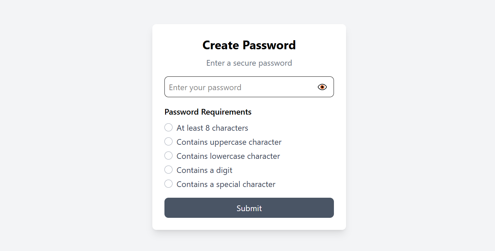

# 🔐 Password Strength Checker (React + TailwindCSS)

A responsive password strength checker built with **React** and **TailwindCSS** that validates password requirements in real time.

## Features

- Live password validation as you type.
- Eye toggle to show/hide password.
- Checks for:
  - At least 8 characters
  - Contains uppercase character
  - Contains lowercase character
  - Contains a digit
  - Contains a special character
- Submit button that clears the input and displays the created password.
- Fully responsive and styled with TailwindCSS.

## Preview



## Technologies Used

- **React** – Frontend library
- **TailwindCSS** – Utility-first CSS framework
- **JavaScript (ES6)** – No regex used for validation

## Installation & Setup

1. **Clone the repository**

   ```bash
   git clone https://github.com/M-prisca/Check-password-strength.git
   cd Password-strength
   npm install
   npm run dev
   ```

   |=> Feel free to PR 😊.
